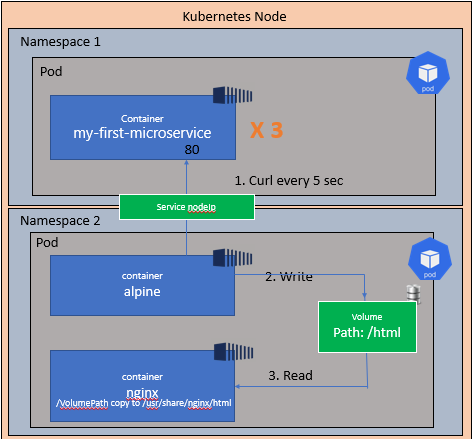

# Challenge 03

Once you are finished with this challenge, you should be able to understand basic
concepts of the following:

- Kubernetes Services
- Kubernetes ReplicaSets
- Kubernetes Deployments
- Kubernetes DNS

### Description

1. Create two namespaces - [Kubernetes Namespaces](https://kubernetes.io/docs/concepts/overview/working-with-objects/namespaces/)

    i. API

    ii. alpine-nginx

2. From current pod.yaml file, move microservice container into a new template file (replica_set.yaml) and change its Kind to ReplicaSet - [Kubernetes ReplicaSet](https://kubernetes.io/docs/concepts/workloads/controllers/replicaset/)

3. Create a new template file (service.yaml), this service needs to route to your microservice into newly created ReplicaSet - [Kubernetes Services](https://kubernetes.io/docs/concepts/services-networking/service/)

4. Create a new template file (deployment.yaml), which is a translation from your ReplicaSet to Deployment - [Kubernetes Deployments](https://kubernetes.io/docs/concepts/workloads/controllers/deployment/)

5. Apply your resources accordingly (Refer to image)

### Diagram

