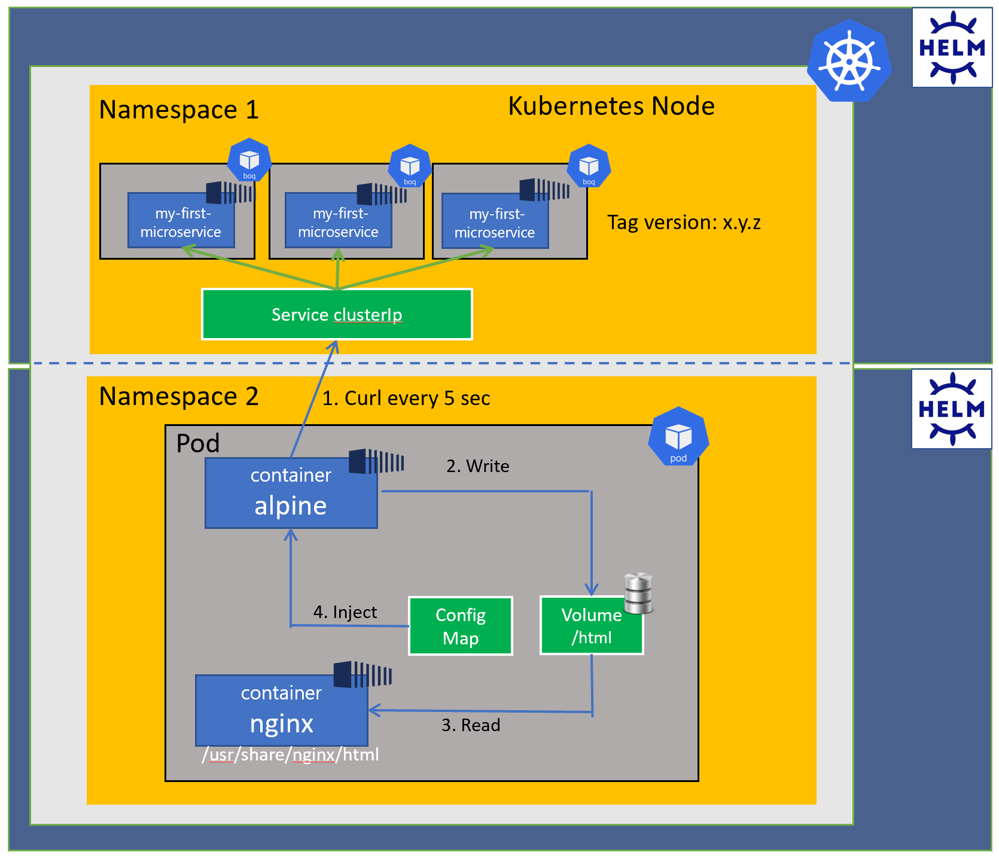

# Challenge 04

Once you are finished with this challenge, you should be able to understand basic
concepts of the following:

- Helm basic
- Helm Structure
- Chart template
- Helm commands
- Helm releases

### Description

1. Read docs helm - [Helm documentation](https://helm.sh/docs/)

2. Install helm - [Helm install](https://helm.sh/docs/intro/install/)

3. Create two helm charts

    3.1. API
         - Deployment template
         - Service template
         - values.yaml

    3.2. Consumer
         - Deployment template
         - ConfigMap template
         - values.yaml

3. Deploy in Kubernetes using helm commands

4. Test 'nginx' container executing a kubectl port-forward 8080:80 and check the response. 

Acceptance criteria:
Contact either Rafael, Gabriel, Nasa or Fermin and run a demo base on this task

### Diagram

Helm Diagram

